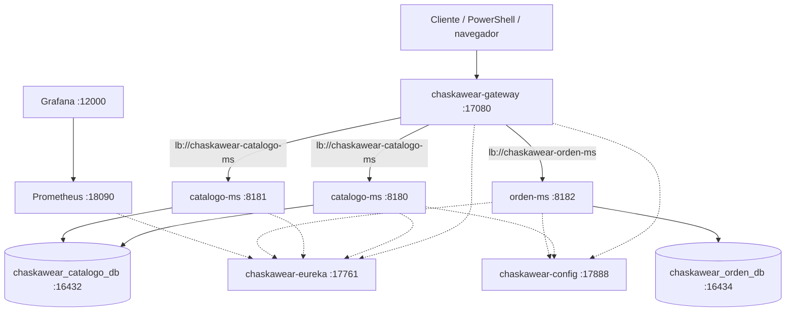

# Brief Técnico — ChaskaWear (Equipo 12)

## 1. Datos del equipo

- **Equipo:** 12
- **Proyecto:** ChaskaWear
- **Sección:** 5to ciclo — Aplicaciones Distribuidas 2026-2
- **Repositorio:** https://github.com/INGYasen/proyecto-final-misticha

| Integrante | Microservicios a cargo (3 c/u) |
|------------|-------------------------------|
| Yasen Cutipa Mayhua | `catalogo-ms`, `orden-ms`, `inventario-ms` |
| Russman Keny Torres Lopez | `pago-ms`, `auth-ms`, `notificacion-ms` |

## 2. Dominio

Ropa artesanal del Cusco (ponchos, chullos, polleras, mantas). Flujo: catálogo → stock → orden → pago → aviso al cliente (Mercado Pago sandbox).

Bases y apps propias: `chaskawear_*` (no se mezclan con Pagatu).

## 3. Microservicios (quién hace qué)

Cada integrante lleva **mínimo dos** microservicios; en este equipo repartimos **tres** por persona.

| Integrante | Transaccional | No transaccionales | Qué hace |
|------------|---------------|--------------------|----------|
| Yasen Cutipa Mayhua | **orden-ms** (Orden + OrdenDetalle) | **catalogo-ms** (Categoria + Producto), **inventario-ms** (Stock + Movimiento) | Publica prendas, controla stock y arma el pedido |
| Russman Keny Torres Lopez | **pago-ms** (Pago + Transaccion) | **auth-ms** (Usuario + Rol), **notificacion-ms** (Aviso + Canal) | Identifica al usuario, cobra y avisa el estado del pedido |

Infra compartida: Config Server, Eureka, Gateway, Prometheus y Grafana.

## 4. Arquitectura (hasta S4)

El cliente no llama a cada microservicio por puerto. Entra por el Gateway (`17080`). El Gateway pregunta a Eureka qué instancias están vivas y reparte con `lb://`.

Qué hay **corriendo ahora** vs **previsto**:

| Componente | App | Quién | Puerto DEV | Estado |
|------------|-----|-------|------------|--------|
| Config | chaskawear-config | equipo | 17888 | S2 · listo |
| Eureka | chaskawear-eureka | equipo | 17761 | S3 · listo |
| Gateway | chaskawear-gateway | equipo | 17080 | S4 · listo |
| Catálogo | chaskawear-catalogo-ms | Yasen | 8180 / 8181 | S1–S4 · listo |
| Orden | chaskawear-orden-ms | Yasen | 8182 | S1–S4 · listo |
| Grafana / Prometheus | obs DEV | equipo | 12000 / 18090 | S4 opcional · listo |
| Inventario | chaskawear-inventario-ms | Yasen | por definir | siguiente |
| Pago | chaskawear-pago-ms | Russman | por definir | siguiente |
| Auth | chaskawear-auth-ms | Russman | por definir | siguiente |
| Notificación | chaskawear-notificacion-ms | Russman | por definir | siguiente |

Rutas del Gateway:

- `/api/v1/categorias/**`, `/api/v1/productos/**` → catálogo (8180 y 8181)
- `/api/v1/ordenes/**`, `/api/v1/orden-detalles/**` → orden (8182)

## 5. Aprobación

- **Docente:** Abel Angel Sullon Macalupu
- **Fecha:** 11/09/2026
